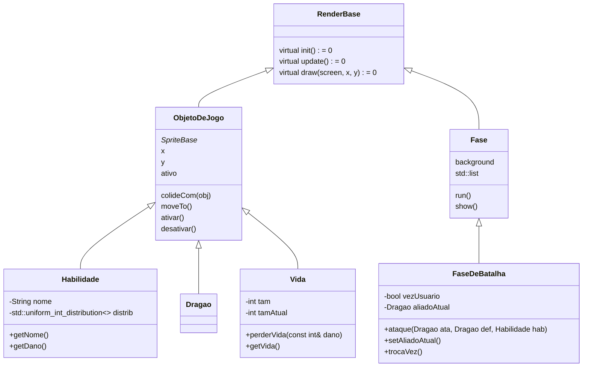

```mermaid
classDiagram
    class RenderBase {
        virtual init() = 0
        virtual update() = 0
        virtual draw(screen, x, y) = 0
    }

    class ObjetoDeJogo {
        SpriteBase*
        x
        y
        ativo
        colideCom(obj)
        moveTo()
        ativar()
        desativar()
    }

    class Fase {
        background
        std::list<ObjetoDeJogo*>
        run()
        show()
    }

    class Dragao {

    }

    class Habilidade {
        -String nome
        -std::uniform_int_distribution<> distrib
        +getNome()
        +getDano()
    }

    class Vida {
        -int tam
        -int tamAtual
        +perderVida(const int& dano)
        +getVida()
    }


    class FaseDeBatalha {
        -bool vezUsuario
        -Dragao aliadoAtual
        +ataque(Dragao ata, Dragao def, Habilidade hab)   
        +setAliadoAtual()
        +trocaVez()
    }

    RenderBase <|-- ObjetoDeJogo
    RenderBase <|-- Fase

    ObjetoDeJogo <|-- Habilidade
    ObjetoDeJogo <|-- Dragao
    ObjetoDeJogo <|-- Vida

    Fase <|-- FaseDeBatalha
```
