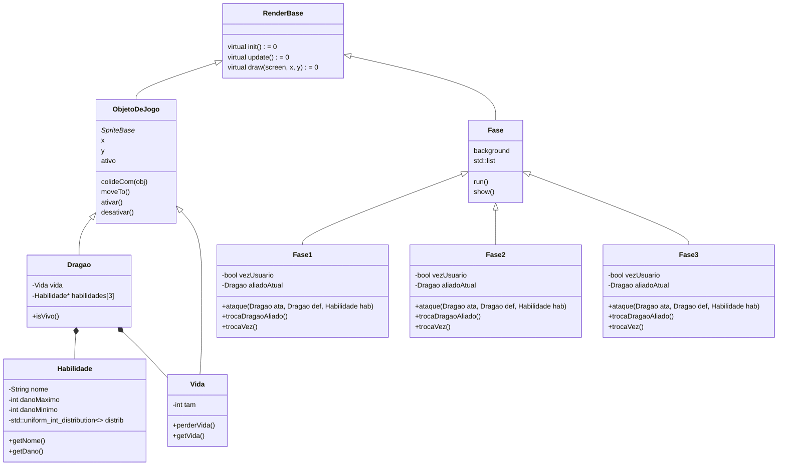

```mermaid
classDiagram
    class RenderBase {
        virtual init() = 0
        virtual update() = 0
        virtual draw(screen, x, y) = 0
    }

    class ObjetoDeJogo {
        SpriteBase*
        x
        y
        ativo
        colideCom(obj)
        moveTo()
        ativar()
        desativar()
    }

    class Dragao {
        -Vida vida
        -Habilidade* habilidades[3]
        +isVivo()
    }

    class Habilidade {
        -String nome
        -int danoMaximo
        -int danoMinimo
        -std::uniform_int_distribution<> distrib
        +getNome()
        +getDano()
    }

    class Vida {
        -int tam
        +perderVida()
        +getVida()
    }

    class Fase {
        background
        std::list<ObjetoDeJogo*>
        run()
        show()
    }

    class Fase1 {
        -bool vezUsuario
        -Dragao aliadoAtual
        +ataque(Dragao ata, Dragao def, Habilidade hab)   
        +trocaDragaoAliado()
        +trocaVez()
    }

    class Fase2 {
        -bool vezUsuario
        -Dragao aliadoAtual
        +ataque(Dragao ata, Dragao def, Habilidade hab) 
        +trocaDragaoAliado()
        +trocaVez()
    }

    class Fase3 {
        -bool vezUsuario
        -Dragao aliadoAtual
        +ataque(Dragao ata, Dragao def, Habilidade hab)
        +trocaDragaoAliado()
        +trocaVez()
    }

    RenderBase <|-- ObjetoDeJogo
    RenderBase <|-- Fase

    ObjetoDeJogo <|-- Dragao
    ObjetoDeJogo <|-- Vida

    Fase <|-- Fase1
    Fase <|-- Fase2
    Fase <|-- Fase3

    Dragao *-- Habilidade
    Dragao *-- Vida
```
